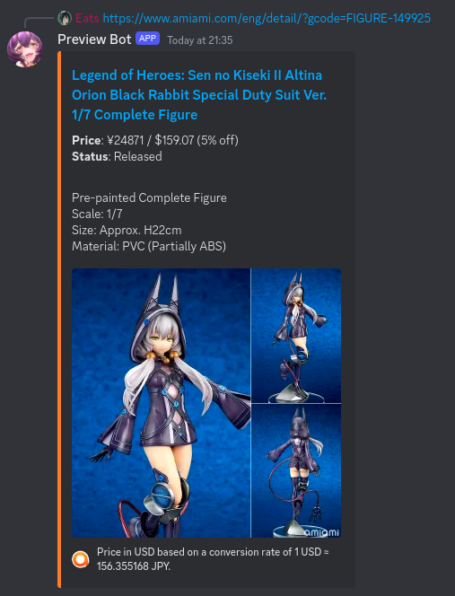
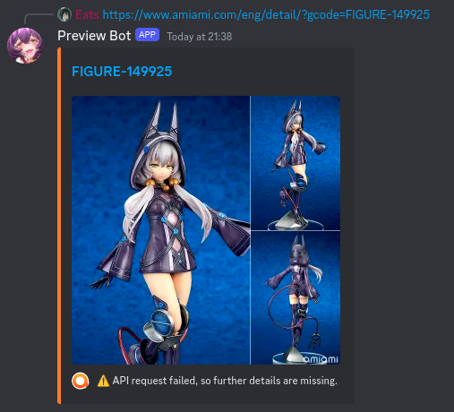
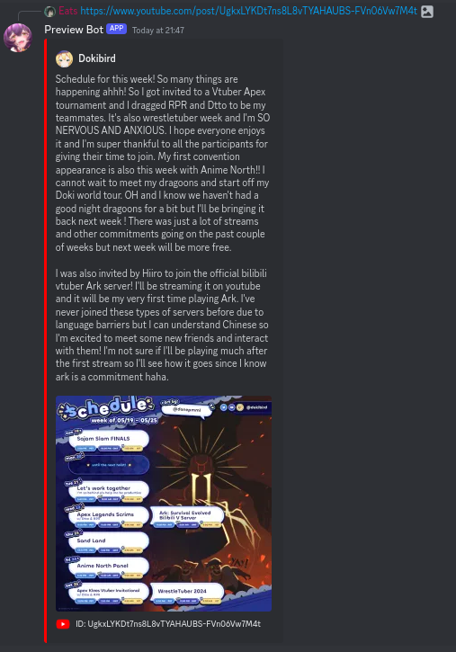
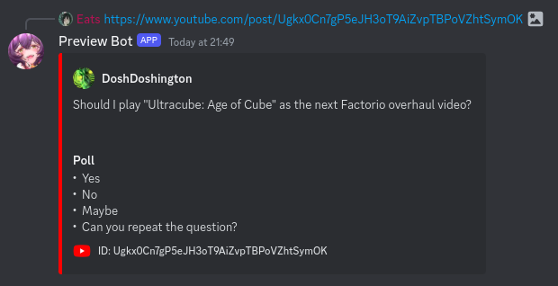

# Preview Bot

Generates embed previews for sites that don't natively support it, such as [AmiAmi](https://amiami.com) and YouTube community posts
(which for some reason only embed channel metadata instead by default).

> [!NOTE]
> The bot is currently semi-private. If you'd like to use my instance, reach out to me on Discord!
# Examples

## AmiAmi

With API access

    

Fallback

## YouTube

Image posts

Poll/quiz posts

> ⚠️ Quiz posts do not currently have a way to display the correct answer.

## Contributing

This bot is not supposed to be super complex, but contributions are always welcome!

If you'd like to add a major feature (such as support for a new site), I'd appreciate it if you [open an Issue](https://github.com/Mampfinator/preview-bot/issues/new) first or reach out to me on Discord.
