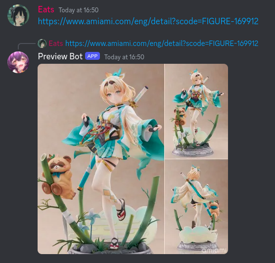

# Preview Bot

Replies to messages that contain [AmiAmi](https://www.amiami.com/) links to individual figures with image previews.

It's incredibly crude, but usually works fine.

Currently it only works for entries with a `FIGURE-` g-/scode. If you're interested in why, check the [How it works](#how-it-works) section.

## How it works

Since both the frontend and the internal API are pretty locked down in terms of bot protection, this bot doesn't even attempt to use those.
Instead, it makes educated *guesses* for a figure's preview image URL on `img.amiami.com`, since that doesn't seem to care about bots.

Image URLs are structured `https://img.amiami.com/images/product/main/${quarter}/FIGURE-${code}.jpg`, where the `quarter` is (what I assume to be) the quarter in which the figure was added to the site. The bot assumes that there's a basically linear relationship between a figure's `code` and its `quarter`, and estimates an initial `quarter` based on figures it has already seen. If it's wrong, it adjusts its guess and keeps trying.

While it's technically possible to have datasets for estimating for every type of code (other than `FIGURE`), it'd lead to a lot of complexity and ultimately wouldn't be incredibly useful - since figures are by and large the main use for AmiAmi.

## Contributing

This bot is not supposed to be super complex, but contributions are always welcome!

If you'd like to add a major feature, I'd appreciate it if you [open an Issue](https://github.com/Mampfinator/preview-bot/issues/new) first or reach out to me on Discord.
